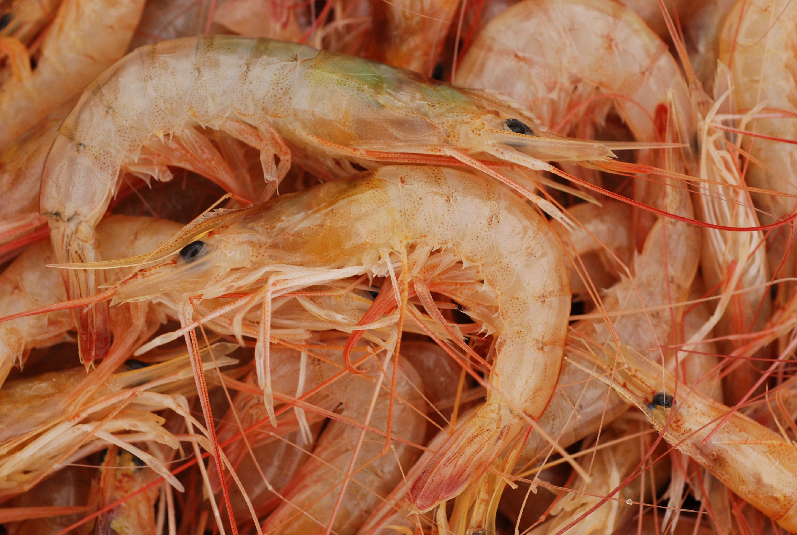
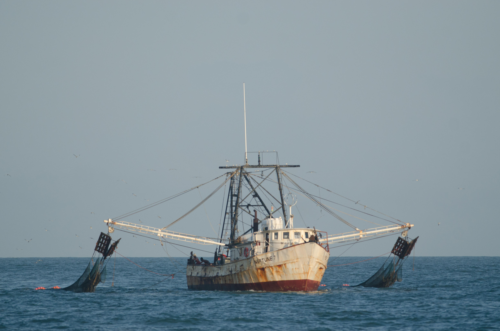

---
title: "Suriname seabob shrimp CPUE analysis"
author: "T. Willems"
date: "2023-06-24"
output: 
  cleanrmd::html_document_clean:
    theme: NULL
---

```{r setup, include=FALSE}
knitr::opts_chunk$set(echo = FALSE) # this will determine whether ANY code chunks #will be displayed in the report or not
# To produce floating table of contents, use toc: true and toc_float: true
# different themes can be set, e.g., theme: cerulean

#to use the cleanrmd fuction:
##require(devtools)
##install_github("gadenbuie/cleanrmd")
##require(cleanrmd)
```

```{r libraries, include=FALSE}
library(tidyverse)
library(ggplot2)
library(lubridate)
#install.packages("ggthemes")
library(ggthemes)
```

## 1. Seabob shrimp fishery in Suriname

### 1.1 The Atlantic seabob shrimp *Xiphopenaeus kroyeri* 
The Atlantic seabob shrimp *Xiphopenaeus kroyeri* (simply referred to as ‘seabob’) is a relatively small and short-lived shrimp species living in the shallow coastal waters on fine silt and muddy substrates, reaching commercial densities up to a depth of 33m in the Guianas. The species occurs along the Eastern coasts of North and South America, from 33oN to 33oZ. There are indications that the species reproduces year-round, with peaks in the rainy seasons (August and December). Observations indicate that seabob favours shallower, less saline near-shore waters in the dry season.

```{r picture1, echo=FALSE, fig.cap="Atlantic seabob shrimp *Xiphopenaeus kroyeri*", out.width = '70%'}


```

### 1.2 The seabob shrimp fishery

The seabob industry uses ‘twin-rig’ shrimp trawlers which land the shrimp on ice to both Surinamese processing companies. The shrimp are peeled mechanically and frozen for export to Europa and the USA. Artisanal fishermen catch seabob in the river mouths using fyke nets (so called ‘Chinese seines’). Their catch is marketed fresh or dried for the local marked. This fishery lands about 500 tons per year, while the industrial fishery catches between 8,000 and 10,000 tons/year.

```{r picture2, echo=FALSE, fig.cap="A seabob shrimp trawler off Suriname", out.width = '70%'}


#
```

## 2. Dynamics of the seabob trawl fishery (2002 - 2022)

```{r load data, include=FALSE}
sb <- read_csv("Suriname_seabob_catch-effort_2002-2022.csv")
glimpse(sb)
```

```{r, add month, inlcude=FALSE}
sb <- sb %>% 
  mutate(month_txt = lubridate::month(month, label = TRUE, abbr = TRUE))
```

```{r, include=FALSE, warning=FALSE}
# summarize catch per year
catch_pw_kg_yr <- sb %>%  
  group_by(year) %>% 
  summarize(catch_pw_kg_yr=sum(catch_pw_kg))

# summarize effort per year
effort_das_yr <- sb %>%  
  group_by(year) %>% 
  summarize(effort_das_yr=sum(effort_das)) 

# summarize cpue per year
obs_cpue_yr <- sb %>%  
  group_by(year) %>% 
  summarize(obs_cpue_yr=mean(obs_cpue))

# joining catch, effort and cpue per year into a new dataframe
sb_yr <- catch_pw_kg_yr %>% 
  left_join(effort_das_yr)
sb_yr <- sb_yr %>% 
  left_join(obs_cpue_yr) 
view(sb_yr)
```

### 2.1 Background on the dataset

The dataset contains monthly catch and effort data of the Atlantic seabob shrimp *Xiphopenaeus kroyeri* industrial trawl fishery off Suriname, from 2002 to 2022.

The data contains the following variables: 
```{r}
names(sb)
```
Catch weights are represented in processed (peeled and beheaded) weight, in kilograms, as received from the fishing industry. Effort is represented as days-at-sea, calculated by the formula *departure date - arrival data + 1*. 
*Obs_cpue* is the catch divided by effort, while *hcr_cpue* is the cpue index used in the fisheries' harvest control rule (HCR). *month* and *month_text* represent the month by numbers (1-12) and text (Jan, Feb,..) respectivly. 

Here is a glimpse of the dataset:

```{r, include=TRUE, echo = FALSE}
head(sb)
```
### 2.2 Some data exploration

First, lets look at yearly catch and effort between 2002 and 2022.

```{r, warning=FALSE, fig.width=6,fig.height=4}
#plot with catch & effort by year
coeff <- 1000
ggplot(sb_yr, aes(x=year)) +
  geom_line(aes(y=effort_das_yr), colour ='darkgreen', linetype=2, size=.8) + 
  geom_line(aes(y=catch_pw_kg_yr / coeff), colour = 'darkblue', size=.8) + 
  scale_y_continuous(
    name = "Effort (DAS)",
    sec.axis = sec_axis(~.*coeff, name="Catch (kg, processed)")) +
labs(x = "Year",
     title = "Seabob shrimp catch and effort (2002 - 2022)",
     caption = "Blue line = catch, green line = effort") +
    theme_clean()
```

Now, let's explore yearly catch-per-unit-effort (CPUE).

```{r, warning=FALSE, message = FALSE, fig.width=6,fig.height=4}
ggplot(sb_yr, aes(year, obs_cpue_yr)) +
  geom_point() +
  geom_smooth(colour='darkred') +
  geom_line()+
  labs(x = "Year",
       y = "CPUE (kg/day)",
       title = "Seabob shrimp CPUE 2002-2022") +
       #caption = "Data from Suriname") +
  theme_clean()
```

The graph below summarizes the CPUE per month, over the period 2002-2022.

```{r, fig.width=6,fig.height=4}
sb %>%  
  group_by(month_txt) %>% 
  #summarize(obs_cpue_mt=mean(obs_cpue)) %>% 
  ggplot(aes(month_txt, obs_cpue)) +
  geom_boxplot(colour='darkred') +
  theme_classic()+
  labs(x = "Month",
       y = "CPUE (kg/day)",
       title = "Monthly seabob shrimp CPUE (2002-2022)",
       caption = "Monthly CPUE summarized over the period 2002-2022") +
  theme_clean()
```

